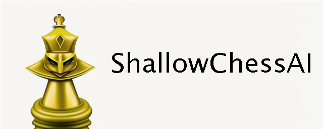
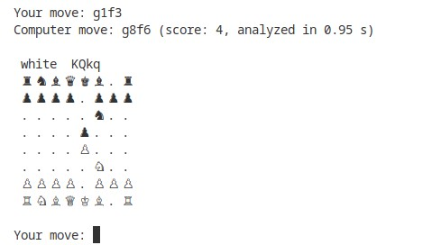

# ShallowChessAI

    <!--
    
    -->
    

ShallowChessAI is a free and open-source chess engine written in Julia. It implements a simple Minimax search algorithm with alpha-beta pruning and employs a Multi-Layer Perceptron (MLP) neural network as an evaluation function. This MLP model has been trained on a dataset of chess boards extracted from Lichess games and further extended by introducing random moves. Following the work of [Maesumi](https://arxiv.org/abs/2007.02130v1), each board was evaluated using Stockfish with a fixed depth of 10 with the goal of embedding some ahead information into the heuristic.

Features
--------

- [x] AI-powered chess engine that uses a Minimax search algorithm with alpha-beta pruning
- [x] Evaluation function based on a MLP neural network
- [x] Low search depth possible thanks to the ahead information embedded during training
- [x] Small and fast model of 24k params included. Trained on 483k boards on a single desktop CPU for a few minutes, it can play surprisingly well for its size
- [x] Highly flexible heuristics that can be adapted to the available computing resources and/or to the desired speed
- [ ] UCI protocol compatibility - TODO
- [ ] Web GUI and online demo in C/C++ (WASM) - TODO

Getting started
---------------

To play with ShallowChessAI at zero lookahead, follow these steps:

1. Download and install Julia from the official [website](https://julialang.org/downloads/).
2. Open your terminal or command prompt from the root folder of ShallowChessAI.
3. Run `julia run-zero-lookahead.jl`. Have fun!

    <!--
    
    -->
    

To play chess in a normal setting, follow these steps:

1. Download and install Julia from the official [website](https://julialang.org/downloads/).
2. Open Julia REPL by running `julia` in your terminal or command prompt.
3. Press the `]` key to enter in Package manager mode.
4. Run `add Flux JLD2` to add the required packages to your Julia environment.
5. Open your terminal or command prompt from the root folder of ShallowChessAI.
6. Run `julia run.jl`. Have fun!

Training
--------

Training the MLP model from scratch is as simple as running a single terminal command. It takes only a few minutes on an average desktop computer CPU; a GPU is not necessary.

To train the MLP model on the included dataset, follow these steps:
1. Download the file dataset/training_dataset_490k.zip from this repository and unzip it to dataset/training_dataset_490k.csv.
2. Open the Julia REPL in Package manager mode and run `add Flux JLD2` to add the required packages.
3. Open your terminal or command prompt and run `julia train.jl -i ./dataset/training_dataset_490k.csv`.

To generate your own dataset and train the MLP model on it, follow these steps:
1. Download and install Python+Pip for your operating system.
2. Create a new Python environment and run `pip install chess` to add the required package.
3. Open the Julia REPL in Package manager mode and run `add Flux JLD2 PyCall` to add the required packages.
4. Download Stockfish from the official [website](https://stockfishchess.org/download/).
5. Download a PGN database [like this one](https://database.lichess.org/standard/lichess_db_standard_rated_2013-01.pgn.zst). You may have to unzip it in order to obtain a single large .pgn file.
6. Open your terminal or command prompt and run `julia train.jl --from-pgn ./path/to/database.pgn --uci-engine ./path/to/stockfish.exe`.

License
-------

ShallowChessAI is licensed under the MIT License. See the file named LICENSE for more information.

Contributions
-------------

This collection of Julia scripts is a simple pet project that I made to enter in the world of machine learning. Even though the engine is working correctly and the project met the expectations, it is still very inefficient and lacks many optimizations. I'm committed of improving and maintaining ShallowChessAI, at least for the foreseable future, but for me it has only educational value.

For this reason, I'm not accepting contributions to the codebase. However I welcome any question, feedback or request you may have.

Issues
------

If you encounter any issues while using ShallowChessAI, please open an issue ticket and provide detailed information about the problem you are experiencing.
