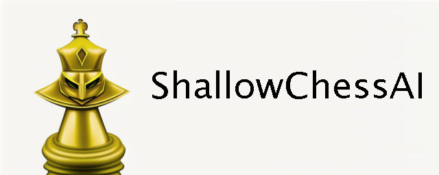
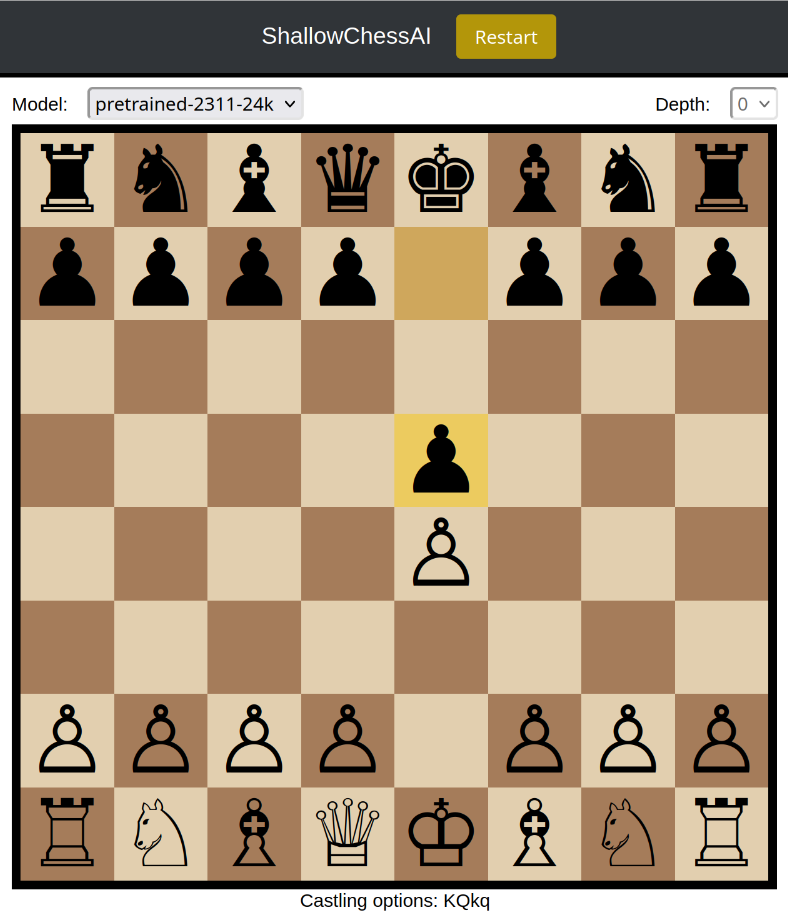
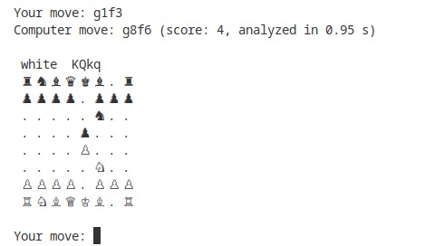

# ShallowChessAI

    <!--
    
    -->
    

ShallowChessAI is a free and open-source chess engine written in Julia. It implements a simple Minimax search algorithm with alpha-beta pruning and employs a Multi-Layer Perceptron (MLP) neural network as an evaluation function. This MLP model has been trained on a dataset of chess boards extracted from Lichess games and further extended by introducing random moves. Following the work of [Maesumi](https://arxiv.org/abs/2007.02130v1), each board was evaluated using Stockfish with a fixed depth of 10 with the goal of embedding some ahead information into the heuristic.

Features
--------

- [x] AI-powered chess engine that uses a Minimax search algorithm with alpha-beta pruning
- [x] Evaluation function based on a MLP neural network
- [x] Low search depth possible thanks to the ahead information embedded during training
- [x] Small and fast model of 24k params included. Trained on 483k boards on a single desktop CPU for a few minutes, it can play surprisingly well for its size
- [x] Highly flexible heuristics that can be adapted to the available computing resources and/or to the desired speed
- [x] Web GUI and online demo in C/C++ (WASM)
- [ ] UCI protocol compatibility - TODO

Online Demo
-----------

The easiest way to access ShallowChessAI is through the [demo app](https://pavanandrea.github.io/ShallowChessAI/webgui/index.html) directly from your browser.
Please note that despite the access from the web, everything is running locally on your device.

<a href="https://pavanandrea.github.io/ShallowChessAI/webgui/index.html">

    

</a>

Getting started
---------------

To play with ShallowChessAI without search, follow these steps:

1. Download and install Julia from the official [website](https://julialang.org/downloads/).
2. Open your terminal or command prompt from the `dev` folder of ShallowChessAI.
3. Run `julia run-zero-lookahead.jl`. Have fun!

    <!--
    
    -->
    

If instead you want to play chess in a normal setting, follow these steps:

1. Download and install Julia from the official [website](https://julialang.org/downloads/).
2. Open Julia REPL by running `julia` in your terminal or command prompt.
3. Press the `]` key to enter in Package manager mode.
4. Run `add Flux JLD2` to add the required packages to your Julia environment.
5. Open your terminal or command prompt from the root folder of ShallowChessAI.
6. Run `julia run.jl`. Have fun!

License
-------

ShallowChessAI is licensed under the MIT License. See the file named LICENSE for more information.

Contributions
-------------

This collection of Julia scripts is a simple pet project that I made to enter in the world of machine learning. Even though the engine is working correctly and the project met the expectations, it is still very inefficient and lacks many optimizations. <!--I'm committed of improving and maintaining ShallowChessAI, at least for the foreseable future, but for me it has only educational value.-->

For this reason, I'm not accepting contributions to the codebase. However I welcome any question, feedback or request you may have.

Issues
------

If you encounter any issues while using ShallowChessAI, please open an issue ticket and provide detailed information about the problem you are experiencing.

References
----------

[1] A. Measumi, "[Playing Chess with Limited Look Ahead](https://arxiv.org/abs/2007.02130)",
    ArXiV Preprint, University of Texas at Austin, Department of Computer Science, 2020

[2] M. Lai, "[Giraffe: Using Deep Reinforcement Learning to Play Chess](https://arxiv.org/abs/1509.01549)",
    MSc Dissertation, Imperial College London, Department of Computing, 2015

[3] L. Spears, "[Train Your Own Chess AI](https://towardsdatascience.com/train-your-own-chess-ai-66b9ca8d71e4)",
    Online Blog Post, Medium Towards Data Science, 2021

[4] M. Sabatelli et al., "[Learning to Evaluate Chess Positions with Deep Neural Networks and Limited Lookahead](https://www.ai.rug.nl/~mwiering/GROUP/ARTICLES/ICPRAM_CHESS_DNN_2018.pdf)",
    Proceedings of the 7th International Conference on Pattern Recognition Applications and Methods - ICPRAM,
    Pages 276-283, SciTePress, 2018, DOI: 10.5220/0006535502760283

