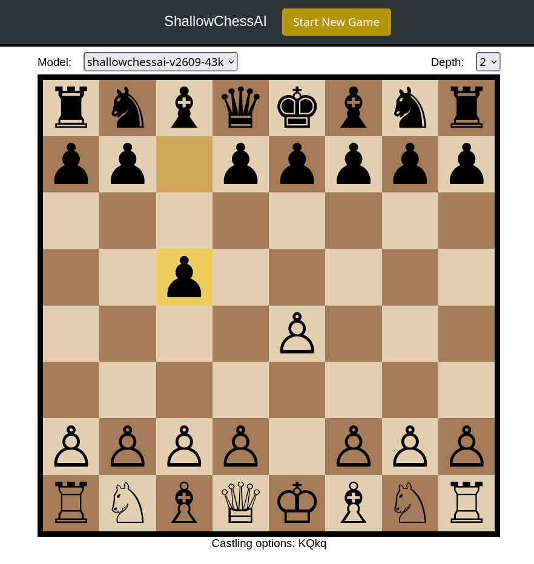

# ShallowChessAI

    

[🌐 Play in your browser](https://pavanandrea.github.io/ShallowChessAI/webgui/index.html)
&nbsp; &bullet; &nbsp;
[📖 Training Documentation](./train/README.md)

ShallowChessAI is a free and open-source chess engine written in pure C.
It implements a classic Minimax search algorithm with alpha-beta pruning, but replaces traditional hand-crafted evaluation functions with a distilled neural network.
By training the model on millions of positions evaluated by Stockfish, the engine "embeds" some look-ahead information into its heuristic, allowing it to play at a very shallow search depth.

✨ Key Features
---------------

- **AI-powered evaluation:** Uses a residual MLP neural network instead of traditional hand-crafted heuristics.
- **Knowledge distillation:** Trained on 38.9 million unique positions using Stockfish 18 as a teacher.
- **Low search depth**: Possible thanks to the ahead information embedded during training.
- **Portable by design**: Can run as a WASM module in the browser or as a library embedded in other applications.
- **Local training**: The model can be trained on a single consumer GPU in just a few hours.

🚀 How to run
-------------

The easiest way to play against ShallowChessAI is via the web demo:

👉 [Launch Web GUI](https://pavanandrea.github.io/ShallowChessAI/webgui/index.html)

<a href="https://pavanandrea.github.io/ShallowChessAI/webgui/index.html">
    

        
    

</a>

*Note: The engine runs locally on your device via WebAssembly (WASM); performance depends on your hardware.*

🤔 Issues
---------

If you encounter any issues, please open an issue in the repository.
Questions, bug reports and suggestions are always welcome.

Contact info: [here](https://pavanandrea.github.io/#contact).

📦 Dependencies
---------------

- [ONNX Runtime Web](https://github.com/microsoft/onnxruntime) - MIT

📑 References
-------------

[1] A. Measumi, "[Playing Chess with Limited Look Ahead](https://arxiv.org/abs/2007.02130)",
    ArXiV Preprint, University of Texas at Austin, Department of Computer Science, 2020

[2] M. Lai, "[Giraffe: Using Deep Reinforcement Learning to Play Chess](https://arxiv.org/abs/1509.01549)",
    MSc Dissertation, Imperial College London, Department of Computing, 2015

[3] L. Spears, "[Train Your Own Chess AI](https://towardsdatascience.com/train-your-own-chess-ai-66b9ca8d71e4)",
    Online Blog Post, Medium Towards Data Science, 2021

[4] M. Sabatelli et al., "[Learning to Evaluate Chess Positions with Deep Neural Networks and Limited Lookahead](https://www.ai.rug.nl/~mwiering/GROUP/ARTICLES/ICPRAM_CHESS_DNN_2018.pdf)",
    Proceedings of the 7th International Conference on Pattern Recognition Applications and Methods - ICPRAM,
    Pages 276-283, SciTePress, 2018, DOI: 10.5220/0006535502760283
