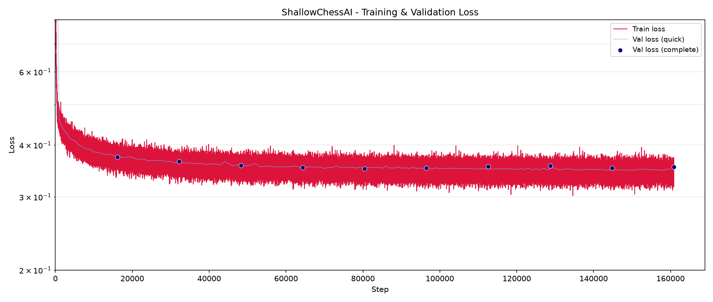

# Model Training (v2609)

The objective of this project is to train a neural network to act as a board evaluation function for a minimax search engine.
The model is trained via supervised learning, using Stockfish 18 as the teacher.

The following sections detail the full pipeline, from environment setup and dataset generation to the testing of the final model.

> [!IMPORTANT]
> Due to file size constraints, the raw data is not hosted in this repository.
> However, all experiments can be fully reproduced by following the instructions below.


## Setup and Environment

The project is entirely developed and executed on a consumer desktop PC:

| Component | Name                         |
| :-------- | :--------------------------- |
| CPU       | AMD Ryzen 5 5600G (6 cores)  |
| GPU       | AMD Radeon R9700 (32GB VRAM) |
| RAM       | 16 GB DDR4                   |
| SSD       | 1 TB M2 NVMe                 |

The operating system is Ubuntu 26.04 with ROCm 7.1 installed via apt.

All the steps are performed within a Python virtual environment to keep dependencies isolated.
The following steps are used to set up the environment:

```bash
cd ./train/
python3 -m venv .venv
source .venv/bin/activate
mkdir .tmp
TMPDIR=./.tmp/ pip install torch==2.13.0 --index-url https://download.pytorch.org/whl/rocm7.1
pip install python-chess tqdm numpy matplotlib onnx onnxruntime
```

A fresh build of the chess library will be needed later to convert FENs to bitboards:

```bash
gcc ../src/chess.c -o ./chess.so -O2 -std=c17 -shared -fPIC -Wall -Wextra
```


## Dataset Generation

Before generating the dataset, it is necessary to determine the optimal search depth for the teacher engine. A higher depth improves accuracy linearly but increases the computational cost exponentially.

As detailed in the [Stockfish Evaluation Convergence report](./experiments/stockfish_convergence/README.md), an experiment is conducted using 200 random positions across depths 6 through 20.
The results indicate that Mean Absolute Error (MAE) on the centipawn scores decreases smoothly and roughly linearly relative to the log-cost of the search.
Because no sharp "convergence knee" can be identified, the choice of depth is treated as a budget decision.

To prioritize rapid iteration and throughput, **depth 6** is selected for dataset generation, accepting a mean error of ~40 centipawns but allowing a total generation time of only 20 hours for the entire dataset of ~38.9 million unique positions.
See the [Dataset Preparation report](./dataset/README.md) for more details.


## Score Function

Centipawn scores are not suitable for neural network training and need to be converted to a floating-point score.
Popular choices are the [Lichess win formula](https://lichess.org/page/accuracy) and the [Leela formula](https://lczero.org/dev/wiki/technical-explanation-of-leela-chess-zero/).
However those were engineered for human display, not for gradient-based optimization.

For this project, a custom formula is derived from scratch to satisfy the following properties:
1. bounded and monotone, preferably with well-scaled magnitudes
2. high gradient near zero - where the most critical engine decisions are typically made
3. strict ordering for mates (i.e. mate in 1 >> mate in 2 >> ...)

For non-mate positions, a hyperbolic tangent function is used:

$$\text{score} = 2 \, \tanh \! \left( \frac{\text{cp}}{364} \right)$$

The input cp is clipped to $\left[ -1500, +1500 \right]$.
The constant $364$ is chosen specifically to map the range of $\left[ -200, +200 \right]$ cp to the $\left[-1, +1 \right]$ interval.
This ensures a high gradient near zero ($\approx 0.0055$ score per cp) increasing resolution in balanced positions at the expense of accuracy at the tails, where the function is smoothly saturated towards $\pm 2$.

Mate positions are handled separately to preserve strict ordering. For a mate in N plies:

$$\text{score} = \pm \! \left( 2 + \frac{1}{N ^ {2/3}} \right)$$

By placing these values above $\pm 2$, the model can distinguish between "slightly winning" and "forced mate", as well as different mates.

As a result, the total output range is strictly monotone and bounded in $\left[-3, +3 \right]$.


## Neural Network Architecture

The model is a small residual Multi-Layer Perceptron (MLP) designed for fast inference during minimax search.
The default configuration uses 2 hidden layers of width 48, for a total parameter count of **42'577**.

In the chess library a position is encoded with 783 bits (64 bits for each of the 12 bitboards, 7 bits for metadata and 8 bits for enpassant).
For inference, the bits are concatenated and expanded into a single vector of size 783 (every element is still 0 or 1, but in FP32 format).

The network maps the 783-dimensional input to a scalar score bounded in $\left[-3, +3 \right]$:



The architecture utilizes an initial projection layer to reduce dimensionality, followed by two residual blocks and a scaled $\tanh$ output.
Each residual block employs a $\text{Linear} \rightarrow \text{LayerNorm} \rightarrow \text{ReLU}$ sequence, which is then added back to the block's input (the skip connection) and passed through a final $\text{ReLU}$:



The input projection accounts for 88.3% of all parameters, which is expected for a very small network, while each residual block contributes only 2448 parameters (5.4%).

Skip connections are included to support future scaling, although they are optional for the current shallow depth.


## Training Process

Dataset formatted as CSV files must be converted into pairs of (input,output) for training.
Doing the conversion during training is slow and would leave the GPU idle, so it is done as a separate preprocessing step.

FEN strings are converted to bitboard format and centipawn/mate are converted to float score.
Positions are shuffled randomly and separated into training and validation data.
Finally, they are exported into NumPy arrays format (NPY).

```bash
python3 01_convert_training_data.py \
          --input ./dataset/dataset_fen_1301.csv \
                  ./dataset/dataset_fen_1301_top5_moves_deduplicated.csv \
                  ./dataset/dataset_fen_1301_random_moves_deduplicated.csv \
          --lib ./chess.so \
          --validation-fraction 0.15 \
          --output-train data_2609_train.npy \
          --output-validation data_2609_validation.npy \
          --seed 42
```

This step takes about 19 minutes, resulting in a 3.4GB training set and a 593MB validation set.

Data is stored as bitboards to save disk space and converted to FP32 on-the-fly during training.
Since the expanded FP32 dataset is too large for the available RAM, the chunk-size parameter is used to stream data from the SSD in small manageable segments.

All computation - parameters, activations, gradients and I/O - is performed entirely in FP32.

The network is trained using the following hyperparameters:
- learning rate: $5 \times 10^{-4}$ (constant after a 200-step linear warmup)
- epochs: 10
- batch size: 2048
- chunk size: 393'216

The final hyperparameters are picked after some quick one-epoch experiments.
The batch size is chosen to maximize throughput:

| BATCH SIZE | TRAINING STEPS   | TIME PER STEP    | EPOCH TOTAL TIME | POSITIONS/S |
| :--------- | :--------------- | :--------------- | :--------------- | :---------- |
| 32         | 1029512          | 1.45 ms          | 1521.0 s         | 21659.7     |
| 64         | 514756           | 1.57 ms          | 832.2 s          | 39587.1     |
| 128        | 257378           | 1.69 ms          | 460.5 s          | 71540.4     |
| 256        | 128689           | 2.06 ms          | 290.3 s          | 113483.9    |
| 512        | 64345            | 2.77 ms          | 203.0 s          | 162287.5    |
| 1024       | 32173            | 4.68 ms          | 177.2 s          | 185916.3    |
| 2048       | 16087            | 9.10 ms          | 172.1 s          | 191425.7    |
| 4096       | 8044             | 17.96 ms         | 169.8 s          | 194018.6    |
| 8192       | 4022             | 35.35 ms         | 167.3 s          | 196917.9    |
| 16384      | 2011             | 69.93 ms         | 165.8 s          | 198699.4    |
| 32768      | 1006             | 140.45 ms        | 166.5 s          | 197864.0    |
| 65536      | 503              | 278.55 ms        | 165.5 s          | 199059.6    |

Total throughput increases as the batch size grows, peaking at $\approx 200\text{k}$ positions/s.
I/O processing is the main bottleneck here, as VRAM usage is not a factor for a model this small (max 0.5GB according to rocm-smi).
Also, GPU utilization decreases at batch sizes larger than 2048, indicating that the GPU is idling while waiting for data from the NVMe SSD.

For these reasons, a batch size of **2048** is chosen, despite the hardware's capabilities to support far larger values.

For the learning rate, $1 \times 10^{-2}$ is a bit aggressive and causes loss spikes, while $1 \times 10^{-3}$ stays stable after one epoch, so a more conservative $5 \times 10^{-4}$ is chosen for added stability.

```bash
python 02_train.py \
         --train data_2609_train.npy \
         --val data_2609_validation.npy \
         --epochs 10 \
         --lr 5e-4 \
         --batch-size 2048 \
         --chunk-size 393216 \
         --val-every 1000 \
         --val-batch-size 32768
```

On the R9700 GPU, each epoch takes roughly 170 seconds (~110 batches/s), for a total training time of ~30min.

To reduce computational cost, full validation is performed only after each epoch, while a "quick" validation on a single batch is run every 1000 steps; these two metrics remained consistently close during the entire run.



Based on the loss curve and on the terminal output, the training run can be considered successful.


## Export and Verification

Because this project is designed to be deployed as both a web-based application (desktop and mobile) and a lightweight portable CLI, the heavy runtime of a PyTorch environment is prohibitive.
Instead, ONNX is chosen for inference because it offers a lightweight runtime optimized for fast inference across a wide variety of hardware and platforms.

The model is converted from PyTorch checkpoint to ONNX format using the following command:

```bash
python 03_export_onnx.py \
         --input checkpoints/best.pt \
         --val data_2609_validation.npy \
         --batch-size 32768 \
         --output checkpoints/best.onnx
```

The conversion is verified by comparing the outputs of the original PyTorch checkpoint and the exported ONNX file, confirming a maximum absolute difference of $3.5 \times 10^{-6}$ on the quick validation set, comparable with machine precision for FP32.


## Testing

To assess the generalization capabilities of the trained model, a final evaluation is performed on a completely independent test set.
Full details, including the testing pipeline and distribution plots, can be found in the [Model Testing report](./test/README.md).

The results are summarized in the table below:

| Non-mate        | Result   |
| :-------------- | :------- |
| MAE             | 120.7 cp |
| Fraction < 50cp | 40.4%    |
| Fraction < 20cp | 17.4%    |
| Fraction < 10cp | 8.7%     |

The consistency between the test MAE and the validation results confirms the model's ability to generalize to unseen data.
However, a MAE of 120.7 cp indicates that absolute performance remains poor.
Moreover, the long tail observed in the error distribution reveals that the model is prone to the occasional catastrophic blunder.
These limitations are expected given the small number of parameters, although the results demonstrate that the network has learned basic trends from the training data.
