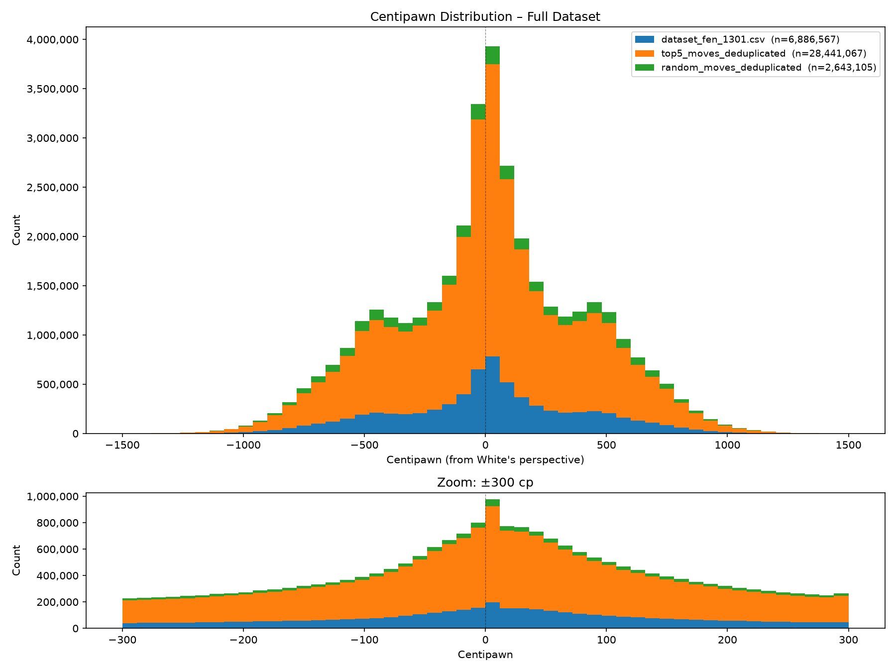

# Dataset Preparation (v2609)

The goal of this stage is to build a training dataset for a neural network.
In this project, Stockfish 18 acts as the "teacher", providing the ground-truth evaluations, while the neural network acts as the "student" learning to predict those scores.

Real chess positions are sourced from the [Lichess open database](https://database.lichess.org/) due to availability and quality.
Using real games ensures that the model is trained on positions that are likely to be met at inference time as well.

For the initial phase of the project, the **January 2013 PGN dump** is used.
This specific file is chosen because it is the smallest available (containing 121'332 games), which allows for quick experimentation.
The compressed file is 17.8MB, expanding to 98.8MB after extraction.

> [!IMPORTANT]
> Due to file size constraints, the raw data is not hosted in this repository.
> However, all experiments can be fully reproduced by following the instructions below.


## Extract FEN Positions

The script `01_convert_pgn_to_fen.py` iterates through every game in the PGN file and extracts every board position reached during the match, converting them into FEN. On a standard desktop, this process takes ~10 minutes, processing roughly 200 games/s.

```bash
python3 01_convert_pgn_to_fen.py \
          --input lichess_db_standard_rated_2013-01.pgn \
          --output dataset_fen_1301.csv
```

A total of 8'276'519 positions are encountered during the extraction process.
Duplicates are automatically filtered out, resulting in a final dataset of **7'138'045 unique positions**.

> [!NOTE]
> Data deduplication is a debated topic in Machine Learning, but in this project it is necessary given the intended role of the neural network. The model is not being trained as a chess player, but rather as a board score predictor: given any position that the search tree will hand it, return an accurate number.
> During a minimax search, the engine will evaluate positions on the principal variation but also dozens of other branches, some of which involve inaccuracies and blunders.
> Therefore, the evaluation must be calibrated across the full distribution of positions the search actually touches, rather than just the "optimal" paths found in games.

While duplicates are removed from the training set, the count of each position's occurrence is retained, just in case.
For instance, when looking at the initial positions, it is immediately apparent that this data identifies the most common openings and can be used to create a "human opening book".


## Evaluate FEN Positions

Stockfish 18 (Linux x64 AVX2 prebuilt binary) is used to analyze each FEN position and output a centipawn score (or a mate in N), as well as the top-5 moves and their scores.

Based on convergence analysis ([read report](../experiments/stockfish_convergence/)), a depth of 8 would be a good balance of throughput (>30 positions/s) and accuracy (mean error ~35 centipawns).
However, for this initial run a depth of 6 is chosen to maximize throughput (~100 positions/s), accepting a slightly worse accuracy (mean error ~40 centipawns).
This reduces dataset generation time from ~66 hours to ~20 hours, which is important for quick experimentation.
Improving this aspect is left to future updates.

```bash
python3 02_evaluate_fen.py \
          --input dataset_fen_1301.csv \
          --moves-output dataset_fen_1301_top5_moves.csv \
          --depth 6 \
          --time-limit 10 \
          --save-every 50000 \
          --threads 16 --hash 8192
```

The CSV file created at the previous step is updated in-place (7'138'045 positions, ~671 MB).
A second CSV file is created with the top-5 moves for each original position (34'334'441 positions, ~2.3 GB).

Due to large file size however the data in this second file cannot be deduplicated at creation.
Duplicated data is present, both within the file itself and with the first csv:

```bash
python3 03_deduplicate_csv.py \
          --input dataset_fen_1301_top5_moves.csv \
          --output dataset_fen_1301_top5_moves_deduplicated.csv \
          --extra-files dataset_fen_1301.csv
```

During the deduplication process, 5'357'856 positions were removed, so the resulting dataset includes a total of 36'114'630 unique positions (including original data), which is more than enough to train a neural network.


## Random Augmentation

A network that is only trained to label good positions will perform badly when the minimax asks to evaluate a bad position in the tree.
Hence, a third CSV file is created by making and analyzing random moves from the dataset.
This is useful to teach the model that blunders are bad.
A ratio of 1:10 is initially deemed sufficient to this scope (2'897'659 positions, ~200 MB):

```bash
python3 04_random_moves_augmentation.py \
          --input dataset_fen_1301.csv dataset_fen_1301_top5_moves_deduplicated.csv \
          --output dataset_fen_1301_random_moves.csv \
          --target 2897659 \
          --depth 8 --time-limit 5 \
          --threads 16 --hash 8192 --seed 42

python3 03_deduplicate_csv.py \
          --input dataset_fen_1301_random_moves.csv \
          --output dataset_fen_1301_random_moves_deduplicated.csv \
          --extra-files dataset_fen_1301.csv dataset_fen_1301_top5_moves_deduplicated.csv
```

On a standard desktop, the augmentation process takes ~5 hours, processing roughly 160 games/s.

During the deduplication process, 156'685 positions were removed from the random dataset


## Final Dataset

To summarize, the final dataset ready for training includes a total of **38'855'604 unique positions** with the following composition:

| Category             | Positions    | Percentage | Size       |
|----------------------|--------------|------------|------------|
| Real games           | 7138045      | 18.4%      | 671.6 MB   |
| Multipv augmentation | 28976585     | 74.6%      | 2.0 GB     |
| Random augmentation  | 2740974      | 7.0%       | 185.5 MB   |
| **Total**            | **38855604** | **100%**   | **2.8 GB** |


The following command is used to generate a centipawn distribution plot across the final dataset:

```bash
python3 05_plot_cp_distribution.py \
          --input dataset_fen_1301.csv \
                  dataset_fen_1301_top5_moves_deduplicated.csv \
                  dataset_fen_1301_random_moves_deduplicated.csv \
          --output dataset_fen_1301_final_cp_distribution.png
```



The distribution is not perfectly symmetric around zero. A small positive bias in favor of white (mean = +15 cp) is given by Stockfish to quantify first-move advantage.

Roughly 28% of all positions fall within ±100 cp, a narrow band where the neural network must be particularly accurate.

The remaining 72% is spread across two tails bounded at ±8115 cp, but only 900 positions exceed ±1500 cp.
A small secondary peak is visible around ±500 cp in all three data sources.
