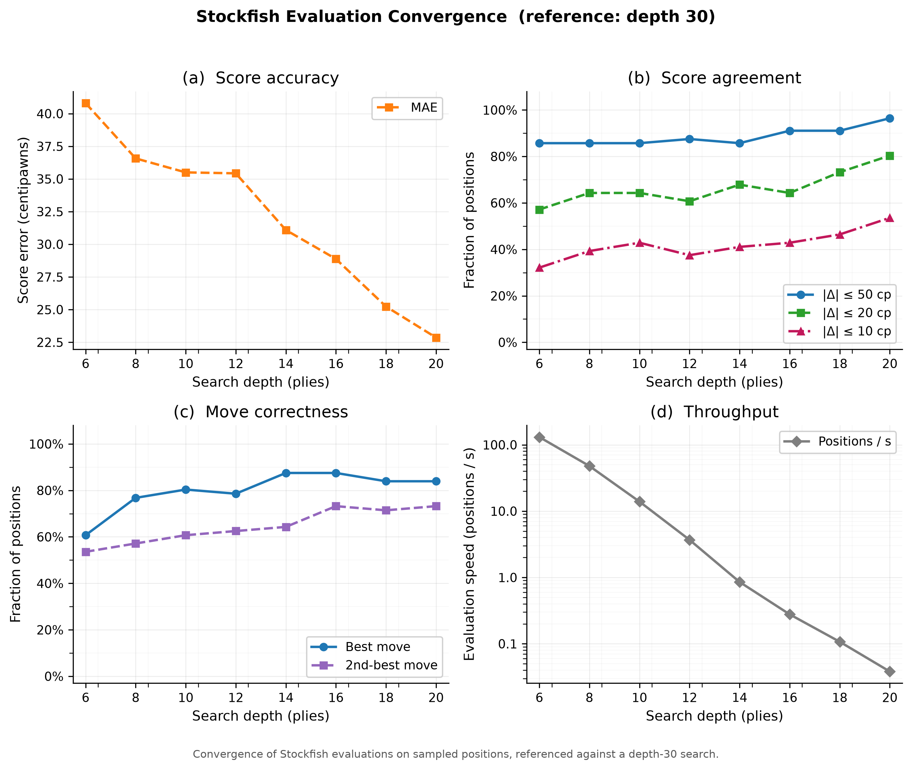

# Stockfish Evaluation Convergence

During supervised training the network learns to reproduce a target value obtained from Stockfish. Any systematic error in that target is inherited by the model.

The ideal experiment would evaluate every position to a very high depth, but that is not possible for millions of positions on consumer hardware.

The goal of this experiment is therefore to measure how centipawn accuracy depends on search depth and to identify a practical search budget beyond which additional search yields diminishing returns.


## Methodology

Prebuilt binaries of Stockfish 18 (Linux x64 AVX2) are downloaded from the [official website](https://stockfishchess.org/download/) and executed from Python using the `python-chess` package (version 1.999) with the following running parameters:
- Threads: 16
- Hash: 8192 MB
- MultiPV: 5
- Depths: 6, 8, 10, 12, 14, 16, 18, 20 (+ 30 as reference)
- Time limit: 200 s per position

The following commands are used to run the experiment:

```bash
source ../../.venv/bin/activate
python3 evaluate_convergence.py ../../dataset/dataset_fen_1301.csv \
          --output convergence_results.csv \
          --depths 4 6 8 10 12 14 16 18 20 \
          --ground-truth-depth 30 \
          --n-positions 200 \
          --time-limit 200 \
          --threads 16 --hash 8192 --seed 42
python3 plot_convergence.py convergence_results.csv
```

The evaluation took approximately 10 hours (36387.5 s), with most of that time spent on the depth 30 reference.

From the resulting 100x9 score matrix the following global quantities are computed per depth:
- Mean absolute error (MAE) in centipawns;
- Fraction of positions whose score agrees with ground truth within ±50cp;
- Fraction of positions with the correct best move;
- Fraction of positions with the correct second-best move;
- Evaluation speed (in pos/s)


## Results

Table 1 summarizes the per-depth statistics:

```
 depth      MAE    max|E|     ±50    best     2nd     pos/s
───────────────────────────────────────────────────────────
     6    40.80     650.0   0.857   0.607   0.536     127.4
     8    36.57     617.0   0.857   0.768   0.571      47.5
    10    35.50     584.0   0.857   0.804   0.607      13.9
    12    35.43     553.0   0.875   0.786   0.625       3.7
    14    31.09     496.0   0.857   0.875   0.643       1.2
    16    28.88     461.0   0.911   0.875   0.732      0.28
    18    25.23     441.0   0.911   0.839   0.714      0.11
    20    22.86     438.0   0.964   0.839   0.732     0.038
```

Figure 1 shows the four panel summary:




## Discussion

Throughput falls exponentially with search depth, from ~130 positions/s at depth 6 to less than 0.04 positions/s at depth 20.

Score error falls monotonically and smoothly. The gain per ply is modest and fairly constant, so MAE falls approximately linearly in log-cost.
There is therefore no sharp score convergence knee; the depth choice is basically a budget decision.

Top-move agreement also improves with depth, from 0.61 at depth 6 to 0.84 at depth 20 for the top move and from 0.54 to 0.73 for the second-best move.
The progression is gradual but the curves are noisy. Small wiggles are expected given the discrete nature of move selection and its near-tie sensitivity: a change of a few centipawns can swap the order of two candidate moves.
Move agreement should therefore be interpreted as a slow, noisy improvement.


## Limitations

The reference is not true ground truth; on hard positions depth 30 is still wrong, so the measured error must be treated as a lower bound.

The sample is random and only 200 positions, enough to see real trends vs random wiggles, but the tail of hard positions may be under-represented.

Top-move correctness and MultiPV ordering in general is very sensitive to near-ties.


## Conclusion

MAE decreases smoothly and roughly linearly in log-cost, with no obvious diminishing returns. Score quality is therefore mostly a question of training budget.

Move agreement improves gradually with depth and shows fluctuations due to near-tie sensitivity, with no sharp threshold evident.

Further work may be needed to isolate and assess the small set of difficult positions that fail to converge and are responsible for the high values of max|E|. However, high depths are needed for an accurate evaluation.
