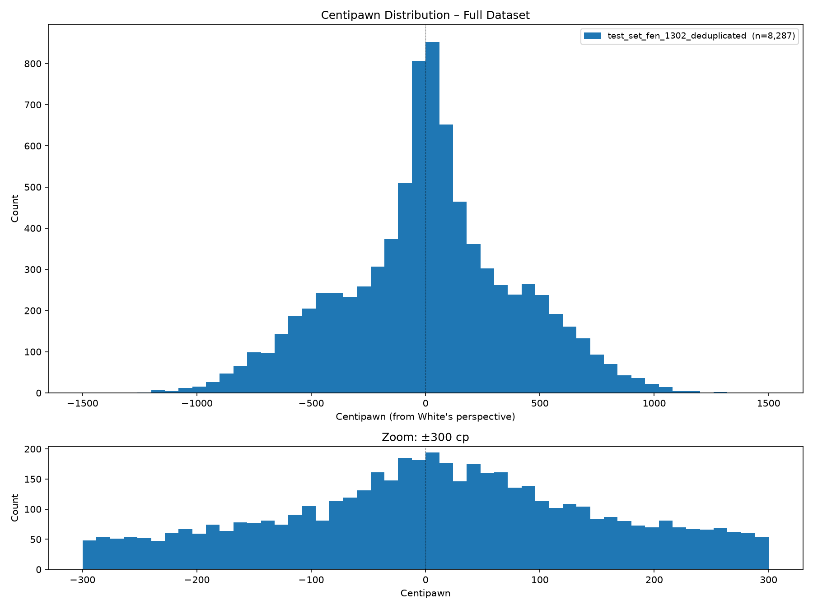
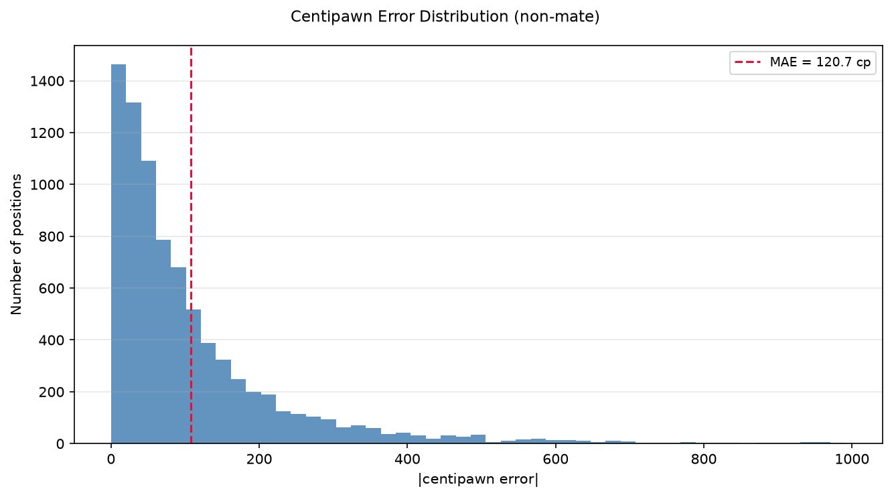

# Model Testing (v2609)

The goal of this stage is to test the capabilities of an already trained neural network.

First, a test set is built starting from positions sourced from the [Lichess open database](https://database.lichess.org/).
The **February 2013 PGN dump** is used to minimize risk of contamination from the training set, which is based on the January 2013 dump.

This specific file contains 123'961 games, but only the first 10000 are used.
The compressed file is 18.2MB, expanding to 94.8MB after extraction.


## Test Dataset Generation

The script `01_generate_test_set.py` iterates through the first 10000 games in the PGN file.
For each game, a single random position is sampled from the mainline, converting it into FEN.
Stockfish 18 (Linux x64 AVX2 prebuilt binary) is used to analyze each FEN position and output a centipawn score (or a mate in N), as well as the top-5 moves and their scores. A depth of 6 is chosen, consistently with the training set.
On a standard desktop, this process takes just ~90 seconds, processing roughly 110 positions/s.

```bash
python 01_generate_test_set.py \
         --input lichess_db_standard_rated_2013-02.pgn \
         --output test_set_fen_1302.csv \
         --size 10000 \
         --depth 6 \
         --threads 16 --hash 8192 --seed 42
```

Duplicates are automatically filtered out, resulting in a set of 10000 unique positions.

The following command is used to eliminate positions that are also present in the training+validation dataset:

```bash
python3 ../dataset/03_deduplicate_csv.py \
          --input test_set_fen_1302.csv \
          --output test_set_fen_1302_deduplicated.csv \
          --extra-files ../dataset/dataset_fen_1301.csv \
                        ../dataset/dataset_fen_1301_top5_moves_deduplicated.csv \
                        ../dataset/dataset_fen_1301_random_moves_deduplicated.csv
```

Roughly 1404 positions are removed, resulting in a final dataset of **8596 unique positions**, including 8287 non-mate positions and 309 mate-in-N positions.

The following command is used to generate a centipawn distribution plot:

```bash
python3 ../dataset/05_plot_cp_distribution.py \
          --input test_set_fen_1302_deduplicated.csv \
          --output test_set_fen_1302_cp_distribution.png
```



Overall, the shape of the distribution seems to closely mirror the one in the [training dataset](../dataset/README.md).

The mean value is basically the same (+16 cp vs +15 cp of the training set).
Roughly 30% of non-mate positions fall within ±100 cp, a slightly higher fraction than the 28% observed in the training set.
Values are bounded between [-1222, 1304] cp, with no positions exceeding the ±1500 cp threshold.
Those small differences can be attributed to the different generation pipeline and to the relatively small sample size.


## Model Evaluation

The following command is used to evaluate the neural network on the test set:

```bash
python3 02_evaluate_onnx.py \
          --model ../checkpoints/best.onnx \
          --set test_set_fen_1302_deduplicated.csv \
          --lib ../chess.so \
          --output cp_error_distribution.png
```

For each position, the error is computed by comparing the model's output against the Stockfish reference scores.

For non-mate positions, the Mean Absolute Error (MAE) is **120.7 cp**.
This value is consistent with the results observed on the validation set (119.7 cp), indicating that the neural network is generalizing well to unseen data.



The error distribution reveals that the model achieves high precision on a significant portion of the dataset, despite its extremely small size: **40.4%** of non-mate positions have an error less than 50cp, **17.4%** less than 20cp and **8.7%** less than 10cp.
These figures suggest that the network is effectively learning from data.

However, the distribution exhibits a very long tail, indicating that absolute performance remains limited and the model is prone to occasional large inaccuracies.
This is expected given the tiny size of the neural network.

Performance on mate positions is similarly limited, with a high MAE of approximately 1.32 score units.
